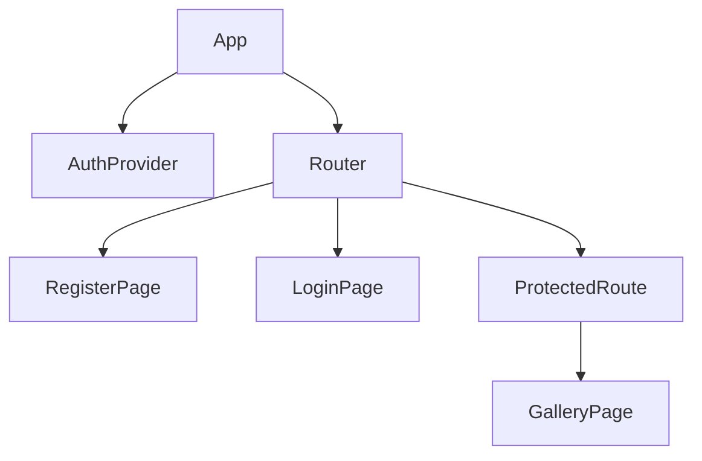
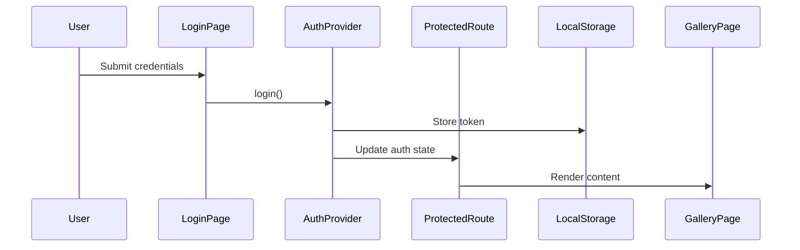
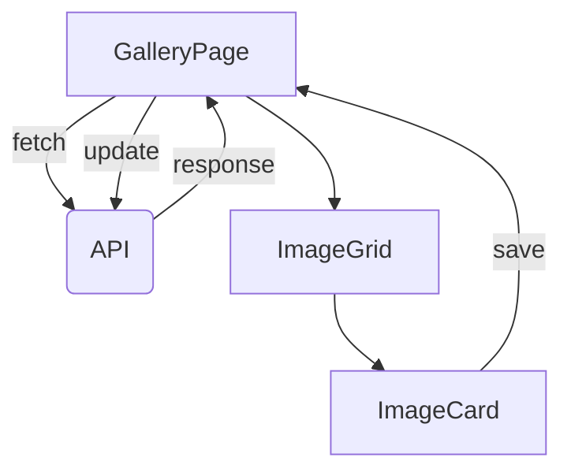

````markdown
# 🖼️ PhotoReact 

An image gallery application built with React and modern web technologies.

## 📦 Component Architecture

### Component Hierarchy


````

### Core Components

| Component       | Type           | Props               | State         | Description                         |
| --------------- | -------------- | ------------------- | ------------- | ----------------------------------- |
| `App`           | Root           | -                   | Auth Context  | Application root with router config |
| `AuthProvider`  | Context        | -                   | User, Token   | Authentication state management     |
| `ProtectedRoute | HOC            | children            | -             | Route protection wrapper            |
| `GalleryPage`   | Container      | -                   | images,quey   | Main gallery interface              |
| `ImageCard`     | Presentational | imageData, onDelete | -             | Image display card                  |
| `UploadForm`    | Composite      | onSave, onClose     | file, preview | File upload modal                   |

## 🔄 Data Flow

### Authentication Sequence



### Image Management Flow


